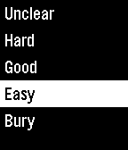

# Pebble Flashcards

This is a learning project in order to create a simple Pebble app, which displays (text-based) flashcards and collects interactive feedback. The feedback is evaluated with python and a new set of questions is prepared.

The Pebble app works without a smartphone. The data is exchanged with a pc. Necessary functions for this exchange can be found in [pebble-pc-communication-example](https://github.com/jim108dev/pebble-pc-communication-example).

## Screenshots





## Install

1. Install [pebble-pc-communication-example](https://github.com/jim108dev/pebble-pc-communication-example).

1. Install repository 's software

    ```sh
    git clone https://github.com/jim108dev/pebble-flashcards.git
    ```

1. Adjust paths in `Makefile` accordingly.

1. Save questions and and answers in `data/reference.csv`. An example is given in `data-example/reference.csv`.

## Usage

### On the Emulator

```sh
# Create `upload.csv`
make prepare_next_session

make install_emu

make upload_emu

# Gather feedback on the device

make download_emu
make translate_binary_emu

# Merge current feedback with history
make merge_feedback
```

### On the Watch

```sh
# Create `upload.csv`
make prepare_next_session

make install_watch

# Unfortunately, the upload is not very reliable. Close the App on the watch 
# and try to upload until 'Questions uploaded ..' is displayed.
make upload_watch

# Gather feedback on the device

make download_watch
make translate_binary_watch

# Merge current feedback with history
make merge_feedback
```

## Limitations

1. The persistent storage on the pebble is limit to 4k. Therefore ids are chosen to be limited to 20 characters, texts to 78 characters and the number of questions/answers is 20 in one session.
