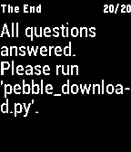

# Pebble Flashcards

This is a learning project in order to create a simple Pebble app. It displays (text-based) flashcards and collects interactive feedback. The feedback is evaluated with python and a new set of questions is prepared.

## Screenshots




## Install

1. Install [pebble-pc-communication-example](https://github.com/jim108dev/pebble-pc-communication-example).

1. Install repository 's software

  ```sh
    git clone https://github.com/jim108dev/pebble-flashcards.git
  ```

1. Create a Python 3 environment

  ```sh
    virtualenv --python=/usr/bin/python3.7 venv
    bash
    source venv/bin/activate
    pip install -r requirements.txt
  ```

1. Set custom questions and and answers in `reference.csv`.

1. Align the history file

  ```sh
  # with venv environment
  cd evaluation
  python align_history.py config.ini
  ```
  
1. Install on the emulator

  ```sh
  cd pebble_app
  pebble build && pebble install --logs --emulator aplite
  ```

1. Install on the device

  ```sh
  # Pair the device before
  cd pebble_app
  pebble build && pebble install --serial /dev/rfcomm0

## Usage

All the steps can also be done with the emulator for testing and inspect debug messages. Just use `config_emu.ini`.

1. Create `upload.csv`

  ```sh
  cd evaluation
  # With Python 3.7 env
  python prepare_next_session.py config.ini
  ```

1. Run the pebble app/ activate bluetooth
  
1. Upload the csv file

  ```sh
  cd connection
  # Alter the path to pebble-pc-template accordingly
  # With Python 2.7 env
  python ~/github/pebble-pc-communication-example/host_python/pebble_upload.py config_watch.ini
  # Or for the emulator
  python ~/github/pebble-pc-communication-example/host_python/pebble_upload.py config_emu.ini
  ```

1. Gather feedback on the watch
1. Download

  ```sh
  python ~/github/pebble-pc-communication-example/host_python/pebble_download.py config_watch.ini
  ```

1. Merge feedback

  ```sh
  cd evaluation
  # With Python 3.7 env
  python merge_feedback.py config.ini
  ```

## Limitations

1. The persistent storage on the pebble is limit to 4k. Therefore ids are chosen to be limited to 20 characters, texts to 78 characters and the number of questions/answers is 20 in one session.
